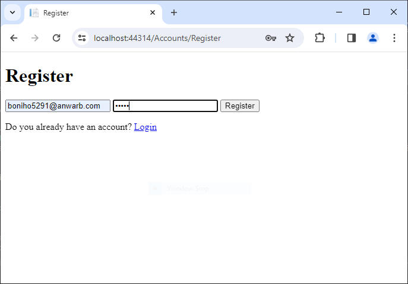
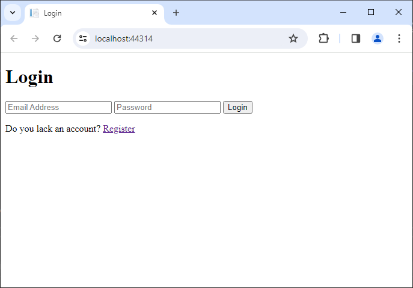
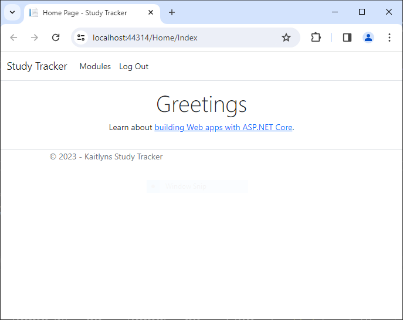
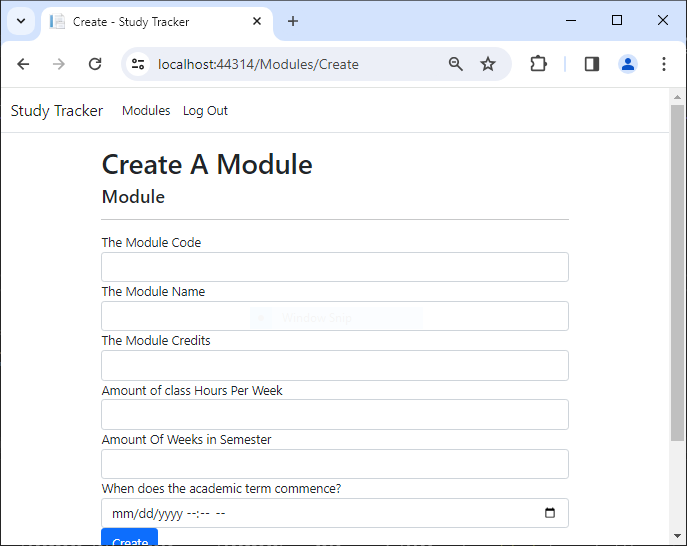
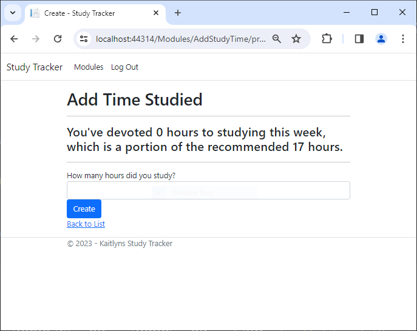
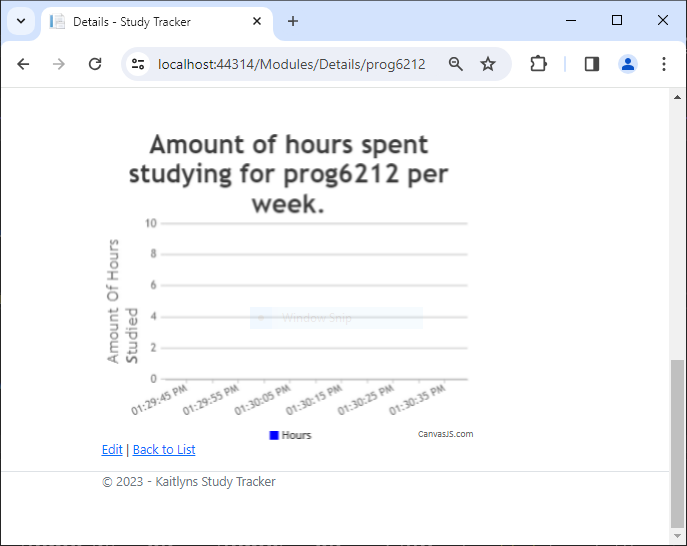

# Kaitlyns Study Tracker

## Run Instructions
Delete all files in migrations folder except `.gitignore` and not the migrations folder itself.
Open the package manager console.
Run `Add-Migration "V1"`
Then run `Update-Database`
Should send to SSMS